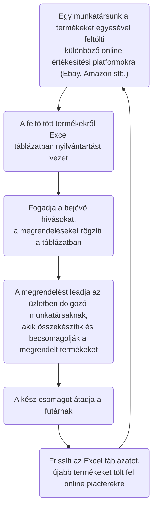
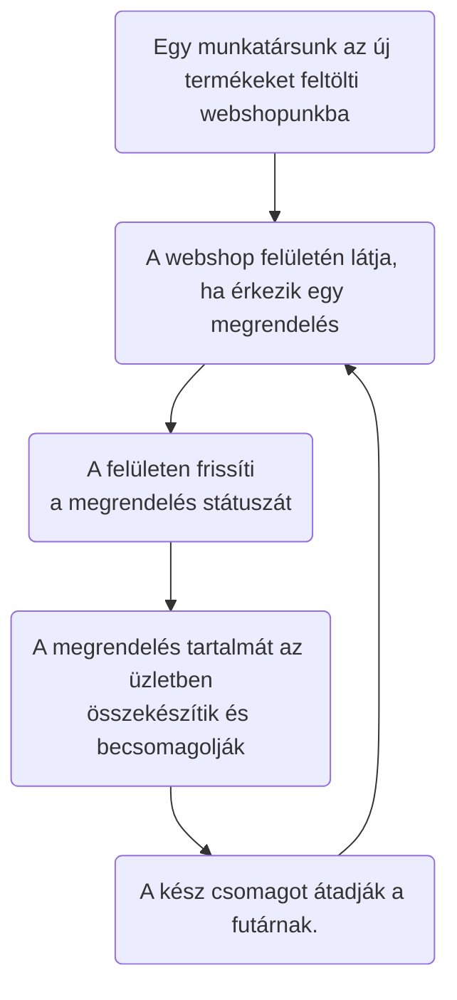

# Funkcionális Specifikáció

### 1. A rendszer céljai

A követelmény specifikációban említett webshop rendszer elkészítése, ahol a felhasználónak és admin jogokkal rendelkező személyeknek külön felület érhető el.

### 2. Jelenlegi helyzet leírása

A termékek jelenleg vásárokban és különböző online vásárterekben kerülnek értékesítésre. A rendelések egy excel táblázatban vannak vezetve, amihez több személy is hozzáfér.
Ebből adódóan a múltban történtek már a rendelésekkel kapcsolatos félreértések.

### 3. Vágyálom rendszer leírása

Hivatkozás a követelmény specifikáció 2. pontjára:

Vállalkozásunk bővítése érdekében szeretnénk üzletünknek honlapot és egyúttal az adminisztrációnkat támogató rendszert. Szeretnénk, hogy ügyfeleink minden termékünket könnyedén megtalálhassák egy igényes és szép weboldalon.

Szeretnénk nyilvántartásunkat online kezelni, hogy az ügyvezetők bárhonnan rá tudjanak nézni az aktuális információkra. A weboldal könnyen üzemeltethető legyen, különböző szintű belépési rendszerrel (admin, user). Termékeket fel lehessen tölteni, módosítani, különböző kategóriákba besorolni.

A kategóriákat ugyanúgy lehessen bővíteni, szerkeszteni, törölni. Kimutatásokat szeretnénk elérni az oldalon keresztül, illetve egy áttekinthető oldalt, ahol azonnal látjuk hány regisztrált ügyfelünk van, hány megrendelés és azok milyen státuszban vannak, valamint hány termék van aktív, illetve törölt állapotban.

Szeretnénk ha az ügyfelek a vásárolt termékekről véleményt is írhatnának(szöveges illetve csillagos értékelést egyaránt), de csak a megrendelt temékek kiszállítása után. Természetesen az ügyfelek regisztrációt követően vissza tudják nézni a korábbi rendelésüket, valamint azok állapotát.

A fentiek alapján a fontosabb szempontok a következők:
- Weboldal és egyben webshop létrehozása
- Nyilvántartások online vezetése
- Külön szintű belépési rendszer létrehozása (admin, user)
- Termékek feltöltésének lehetősége, kategóriákba rendezése, kategóriák szerkesztése
- Kimutatások létrehozásának lehetősége (ügyfelek száma, megrendelések állapota, termékek elérhetősége)
- Felhasználói értékelési és véleményezési rendszer létrehozása

### 3. Jelenlegi üzleti folyamatok

##### 3.1 Személyes értékesítés:
Hagyományos módszerrel történik: A vásárló személyesen kiválasztja az üzletben kiállított terméket, majd az eladó munkatársunknál kifizeti azt.

##### 3.2 Online értékesítés:

### 4. Igényelt üzleti folyamatok

##### 4.1 Személyes értékesítés:
Nem változik

##### 4.2 Online értékesítés:

