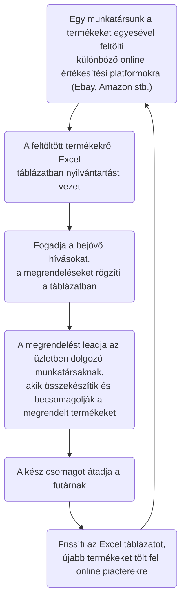
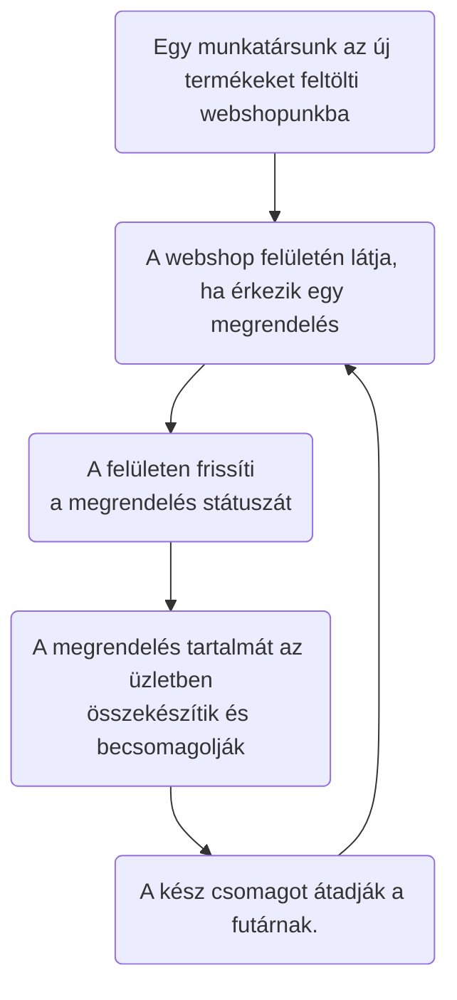

# Funkcionális Specifikáció

### 1. A rendszer céljai

A követelmény specifikációban említett webshop rendszer elkészítése, ahol a felhasználónak és admin jogokkal rendelkező személyeknek külön felület érhető el.

### 2. Jelenlegi helyzet leírása

A termékek jelenleg vásárokban és különböző online vásárterekben kerülnek értékesítésre. A rendelések egy excel táblázatban vannak vezetve, amihez több személy is hozzáfér.
Ebből adódóan a múltban történtek már a rendelésekkel kapcsolatos félreértések.

### 3. Vágyálom rendszer leírása

Hivatkozás a követelmény specifikáció 2. pontjára:

Vállalkozásunk bővítése érdekében szeretnénk üzletünknek honlapot és egyúttal az adminisztrációnkat támogató rendszert. Szeretnénk, hogy ügyfeleink minden termékünket könnyedén megtalálhassák egy igényes és szép weboldalon.

Szeretnénk nyilvántartásunkat online kezelni, hogy az ügyvezetők bárhonnan rá tudjanak nézni az aktuális információkra. A weboldal könnyen üzemeltethető legyen, különböző szintű belépési rendszerrel (admin, user). Termékeket fel lehessen tölteni, módosítani, különböző kategóriákba besorolni.

A kategóriákat ugyanúgy lehessen bővíteni, szerkeszteni, törölni. Kimutatásokat szeretnénk elérni az oldalon keresztül, illetve egy áttekinthető oldalt, ahol azonnal látjuk hány regisztrált ügyfelünk van, hány megrendelés és azok milyen státuszban vannak, valamint hány termék van aktív, illetve törölt állapotban.

Szeretnénk ha az ügyfelek a vásárolt termékekről véleményt is írhatnának(szöveges illetve csillagos értékelést egyaránt), de csak a megrendelt temékek kiszállítása után. Természetesen az ügyfelek regisztrációt követően vissza tudják nézni a korábbi rendelésüket, valamint azok állapotát.

A fentiek alapján a fontosabb szempontok a következők:
- Weboldal és egyben webshop létrehozása
- Nyilvántartások online vezetése
- Külön szintű belépési rendszer létrehozása (admin, user)
- Termékek feltöltésének lehetősége, kategóriákba rendezése, kategóriák szerkesztése
- Kimutatások létrehozásának lehetősége (ügyfelek száma, megrendelések állapota, termékek elérhetősége)
- Felhasználói értékelési és véleményezési rendszer létrehozása

### 3. Jelenlegi üzleti folyamatok

##### 3.1 Személyes értékesítés:
Hagyományos módszerrel történik: A vásárló személyesen kiválasztja az üzletben kiállított terméket, majd az eladó munkatársunknál kifizeti azt.

##### 3.2 Online értékesítés:

### 4. Igényelt üzleti folyamatok

##### 4.1 Személyes értékesítés:
Nem változik

##### 4.2 Online értékesítés:

### 5. Követelménylista 

ID|Verzió|Név|Kifejtés
--|------|---|--------
K01|V1.0|Termékek adminisztrációja|Termékek regisztrálása, törlése az igényelt üzleti folyamatokban leírtak szerint.
K02|V1.0|Vásárlás adminisztrációja|Vásárlások folyamatának kezelése az igényelt üzleti folyamatokban leírtak szerint.
K03|V1.0|Felhasználói fiókok kezelése|Bejelentkezés, felhasználói adatok módosítása, adminok és felhasználók rögzítése az adatbázisban, listák és kimutatások készítése az igényelt üzleti folyamatokban leírtak szerint.
K04|V1.0|Egyszerűen használható kezelőfelület|Az ismertebb böngészőkből használható felhasználói felület megvalósítása, amely mindenki számára a lehető legegyszerűbb átállást eredményezi.
K05|V1.0|Platformfüggetlen működés|Régóta használatos, operációs rendszertől független technológiák használata: Java, HTML/CSS/JavaScript, MySQL.
K06|V1.0|Költséghatékony üzemeltetés|A szabványos és elterjedt technológiák használata biztosítja.
K07|V1.0|Bővíthetőség|A termékek, valamint a felhasználók számának bővíthetősége, illetve új funkciók utólagos hozzáadásának biztosítása.

### 6. Használati esetek

A felhasználó jogosult a termékek kosárba tételére, címének hozzáadására, rendelése állapotának megfigyelésére. Illetve értékelni tudja a megvásárolt terméket, a kézhezkapás után.
Az admin jogosult a felhasználók kezelésére, törlésére. Rendelés állapotának módosítására. Termékek hozzáadására, eltávolítására. Vevői értékelések megtekintésre.

6.1. "User" felhasználói felület:
  6.1.1. A főoldalon jelenjenek meg a termékek kategóriákra bontva. A felhasználó tudjon böngészni ezen termékek között, lássa a termék leírását, értékeléseit, árát. 
  A vásárláshoz, illetve a kosárba helyezéshez bejelentkezés szükséges, amit a fejlécen található gombokkal tud megtenni. 
  Bejelentkezés után tudjon kosárba helyezni, onnan eltávolítani termékeket, tudjon vásárolni, lássa a korábbi rendeléseit, kézhezvételt követően tudjon értékelést írni.

6.2. "Admin" felhasználói felület:
  6.2.2. Bejelentkezés után az "User" felhasználói felülethez hasonlóan a főoldalon minden olyan információ megjelenik, amit a felhasználó is láthat.
    Láthassa, hogy milyen felhasználók vannak regisztrálva, legyen jogosult adatainak kezelésére, törlésére.
    Láthassa a rendelések állapotát, legyen jogosult ezen rendelések módosítására, törlésére.
    Láthassa, hogy milyen termékek vannak feltöltve az oldalra, láthassa ezek adatait, tudja módosítani, törölni, illetve új terméket hozzáadni.
    Vevői értékelések megtekintése, módosítása, törlése.

### 7. Képernyő tervek

Ki kell találnunk azt, amit látni szeretnénk a weblap oldalain, meg kell határozni a színeket, elemeket, képeket, animációkat etc. 
Figyelni kell rá, hogy a tartalomhoz harmonikusan illeszkedjen a megjelenés, messzemenően ügyelve a funkcionalitásra, hiszen egy webshopról van szó, amelyben a használhatóság rendkívül jelentős tényező. 

### 8. Forgatókönyvek

Mint ahogyan egy film esetében, a weblapnál is azt írja le a forgatókönyv, hogy mikor, mi történhet. 
A szereplők itt a nyomógombok, a jelenetek a lapok. 

Kezdőlap: A kezdő lapon található elemek közül a fejléc, a menüsor (menüpontok: kezdőlap, termékcsoportok, vásárlási feltételek, garancia, szállítás, kapcsolat), a weblap minden egyes oldalán megtalálhatóak lesznek. 
A menüsorban a termékcsoportra kattintva lenyílik a menü és megjelennek a termékcsoportok nevei.
Szállítás: egyszerű, statikus szöveg az állandó elemek mellett.
Termékek: Minden termékről látható legalább egy kép. Amennyiben több kép is található a rendszerben az adott termékről, akkor egy kis nyíl jelenik meg a kép mellett, amellyel léptetni lehet őket. 
Kosár (rendelés leadása): a kosárban lévő termékek miniatűr képpel és felirattal jelennek meg, mellettük egy szám, amely a rendelés mennyisége. Ezt a számot szabadon átírhatjuk. 
A megrendelés lépéseinél végig egyszerű űrlapok és szövegek jelenek meg.
Regisztráció: egy egyszerű űrlap áll a rendelkezésre. 
